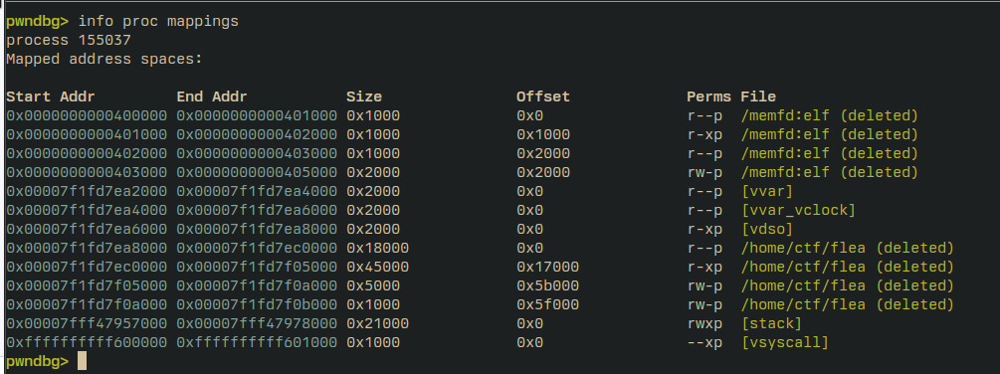

+++
title = 'CSCG 2025: Flea (Misc)'
date = 2025-05-01T18:00:00+01:00
draft = false
+++

flea was a misc challenge of medium difficulty at CSCG 2025 with the following description:

> Help, my ~~flag~~ ~~binary~~ flag keeps disappearing

Upon downloading the attachment, we're presented with a small Rust application which is the core of the challenge:

```rs
use base64::{engine::general_purpose::STANDARD, Engine as _};
use itertools::Itertools;
use nix::sys::memfd::{memfd_create, MemFdCreateFlag};
use nix::unistd::{fexecve, ftruncate, unlink, write};
use std::ffi::CStr;
use std::io::BufRead;
use std::os::fd::AsRawFd;

#[allow(unused)]
const FLAG: &str = "flag{*************** REDACTED ***************}";

fn main() {
    std::panic::set_hook(Box::new(|info| {
        if let Some(payload) = info.payload().downcast_ref::<&str>() {
            eprintln!("fatal error: {}", payload);
        } else if let Some(payload) = info.payload().downcast_ref::<String>() {
            eprintln!("fatal error: {}", payload);
        } else {
            eprintln!("fatal error: unspecified error");
        }
        std::process::exit(1);
    }));

    core::hint::black_box(&FLAG);

    let binary = std::env::current_exe().expect("failed to get current executable");
    unlink(&binary).expect("failed to delete current executable");

    println!("Give me an ELF file (base64-encoded, followed by an empty line):");

    let encoded = std::io::stdin().lock().lines().map(|line| line.expect("failed to read input")).take_while(|line| !line.is_empty()).join("");
    let input = STANDARD.decode(encoded).expect("input is invalid base64");

    let fd = memfd_create(c"elf", MemFdCreateFlag::MFD_CLOEXEC).expect("failed to create memfd");
    ftruncate(&fd, input.len().try_into().expect("failed to convert size")).expect("failed to resize memfd");

    let mut offset = 0usize;
    while offset < input.len() {
        offset += write(&fd, &input[offset..]).expect("failed to write to memfd");
    }

    fexecve::<&CStr, &CStr>(fd.as_raw_fd(), &[c"flea"], &[]).expect("failed to execute target");
}
```

Essentially, what this does is:

1. Set a panic hook that prints the argument of the subsequent usages of `expect` to
   catch errors.
2. Tell the Rust compiler to not optimize out the `FLAG` string, which is unused otherwise.
3. Delete the current executable file from the filesystem with `unlink(2)`. [^1]
4. Take a base64-encoded ELF file, do a `memfd_create(2)` [^2] to create a virtual and anonymous
   file descriptor, living solely in the virtual memory space of the current process, not backed by
   filesystem blocks like an off-disk file would be.
5. `fexecve` into that ELF file, replacing the current process with the new program.

This basically gives us the primitive to run arbitrary user-provided code on the machine. Sounds easy enough, right?
Problem: The file containing the flag is gone.

## Down the 🕳️s!

At this point, I went down some separate holes:

- Exploiting the instancer, which we get as a binary as part of the attachment. It looks a little wonky, as it inserts
  the flag into the Rust binary from an environment variable. If we could somehow replace the `/home/ctf/flea` executable
  (the Rust app) with our own executable containing the placeholder string and then get the instancer to restart, we should
  have the flag. Unfortunately, the second part (getting the instancer to restart) didn't seem possible while keeping
  container / filesystem state alive to keep our replaced executable.
- Racing the instancer to have 2 separate invocations of the Rust app at the same time. This is trivial, as the instancer
  allows for concurrent connections, but the race window is infeasibly tiny. One instance needs to go through the entire
  ELF-decoding, memfd-creating AND executing the new binary while the other one needs to stay *before* the `unlink` call,
  where it panics and exits. If that race window would be larger, one process could just read anothers `/proc/self/exe`
  prior to the `unlink` call.
- Exploiting some other misconfiguration in the provided system environment. But both a kernel exploit and a container
  escape seem a little sophisticated for a medium-difficulty challenge.

## Me when `execve(2)`

I wanted to find out what happens during an `execve` that causes the old memory sections of the process
(containing the flag binary) aren't available from within the new process. If they were, we could just
read the existing memory from the new executable and profit.

So I had to bite the bullet and read through the kernel code to see what's actually going on when you
`execve(2)`. [^3] The interesting section is this part from `fs/binfmt_elf.c` [^4]:

```c
static int load_elf_binary(struct linux_binprm *bprm)
{
    // ...
    /* Flush all traces of the currently running executable */
	retval = begin_new_exec(bprm);
	if (retval)
		goto out_free_dentry;
    // ...
}
```

Among other things, `begin_new_exec` cleans up all existing virtual memory mappings.

The man page [^3] also gives a good explanation on that:

> All process attributes are preserved during an execve(), except the following:
> ...
> - Memory mappings are not preserved
> ...

Duh. It could have been so easy!

I had to find another trace of the deleted binary.

## Me when `unlink(2)`

Per the man page [^1], when you `unlink` something, the flag is not immediately wiped from the underlying file system, but
rather toggled to be wiped once all existing references to that file are dropped. This means that if two processes A and B
have file X open at the same time, and process A calls `unlink(X)`, X will only be wiped of the filesystem once A and B have
closed the file (i.e. dropped their reference to X), either by calling `close(2)` on it, or by exiting.

That's a great finding! This means that if we could somehow keep a reference to that file until our code executes, it
shouldn't be deleted. However, it might still be hard to actually get our program to read that reference. We can't open a
file from an inode number directly, so even if we knew the inode number, we'd still need some interface to the file that can
be accessed from our executable.

## Me when `execve(2)` (again)

Looking at the aforementioned `load_elf_binary` function in the kernel, we can see that there indeed is some stuff going on
*before* flushing the traces of the current executable via `begin_new_exec`. Namely loading the ELF interpreter.

The ELF interpreter, also referred to as `loader`, and found in `/lib/ld-linux.so.2` on most systems, is tasked with
preparing an ELF file for execution by setting up memory sections, setting up the entrypoint of the binary, and loading and
preparing shared library calls.

Now, since this interpreter, and it's file, is accessed *before* resetting the memory mappings and dropping the reference
to the flag binary, if the interpreter is a reference to the already-unlinked `/home/ctf/flea` binary, we should be able
to still see it in the virtual memory sections of the process after the `execve` call.

The interpreter of an existing binary can be modified via the patchelf tool[^5]:

```sh
patchelf --set-interpreter /proc/7/exe main
```

The `/proc/7/exe` is a reference to the `/home/ctf/flea` process, which we use to keep the reference open, and the PID seems
to be deterministic, also on the remote instance for the challenge.

Note that this *will* cause the `main` binary to crash, as it's not loaded properly, but we only care about the part until
we reach the interpreter here to make the `/home/ctf/flea` binary re-enter.

And indeed, that works. Attaching to the process with GDB shows the regions, after the `execve` call:



`/home/ctf/flea` is still open! Nice!

As a side-effect of the `/home/ctf/flea` re-entrancy, we also end up with a garbled PC / RIP at `0x5c996`. Presumably
caused by a absolute jump somewhere at the start of `/home/ctf/flea`, causing us to land outside of a mapped region.

## Exploitation!

This PC issue can trivially be circumvented by nop-sledding our `main` binary that we submit so that it just lines up the
useful function (i.e. something that prints the flag) at `0x5c996`.

This can be achieved with a binary like this:

```asm
.intel_syntax noprefix

.global main

main:
    .rept 0x999
        nop
    .endr
    xor rax, rax
    mov rax, 1
    mov rdi, 1
    mov rsi, [rsp]
    sub rsi, 0xedac
    mov rdx, 100
    syscall
```

This simply assembles to a sequence of 0x999 `nop` instructions, and some shellcode that prints the flag. The offset of
`0xedac`, which is the location of the flag string in memory, can be conveniently found via pwndbg's `search` function. [^6]

This can be assembled into an object file and packaged into an ELF via:

```sh
as -o main.o main.s
ld --section-start=.text=0x5c000 --dynamic-linker=/proc/7/exe -lc -o main main.o
```

This `ld` command sets the starting point of the `.text` section to `0x5c000`, so that the PC at `0x5c996`
aligns with 3 more nops of the nop sled, and then our flag-leaking code.
The `--dynamic-linker=/proc/7/exe` argument sets the ELF interpreter as `patchelf` did above.
The `-lc` flag is required to force the linker into creating a dynamically linked executable, even though we don't
have any library calls.

When sending that payload to the server, we get the flag:

> `CSCG{th3_x7fELF_0n_th3_sh3lf_a534d73f80969de6}`

This was a very fun challenge to do, and has taught me a lot on how ELF execution in Linux works.

It also corresponds nicely to some vulnerabilities previously seen in in-the-wild container escapes, but that's a story for
another day. [^7]

[^1]: https://man7.org/linux/man-pages/man2/unlink.2.html
[^2]: https://man7.org/linux/man-pages/man2/memfd_create.2.html
[^3]: https://man7.org/linux/man-pages/man2/execve.2.html
[^4]: https://elixir.bootlin.com/linux/v5.10.236/source/fs/binfmt_elf.c
[^5]: https://github.com/NixOS/patchelf
[^6]: https://browserpwndbg.readthedocs.io/en/docs/commands/procinfo/search/
[^7]: https://unit42.paloaltonetworks.com/breaking-docker-via-runc-explaining-cve-2019-5736/
