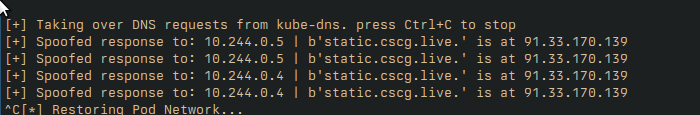

+++
title = 'CSCG 2025: Supercluster (Misc)'
date = 2025-05-01T18:00:00+01:00
draft = false
+++

supercluster was a misc challenge of medium difficulty at CSCG 2025 with the following description:

> I created a website that always shows the latest information about superclusters.
> To show this stellar information to everyone the website is deployed in a kubernetes cluster. But currently there are still some bugs.
> I invite you as a beta tester to find these bugs for me. You get restricted access to my cluster.
> Different namespaces and security policies are in place to prevent you from reading my secrets

Upon downloading the attachment, we're presented with some Kubernetes specs that are applied to the cluster.

We have 3 namespaces in the cluster:

```yaml
apiVersion: v1
kind: Namespace
metadata:
  name: flag
---
apiVersion: v1
kind: Namespace
metadata:
  name: entrypoint
---
apiVersion: v1
kind: Namespace
metadata:
  name: ctf
  labels:
    pod-security.kubernetes.io/enforce: restricted
    pod-security.kubernetes.io/enforce-version: latest
    pod-security.kubernetes.io/warn: restricted
    pod-security.kubernetes.io/warn-version: latest
# ...
```

We're deployed into a pod in the `entrypoint` namespace. The deployment with the flag resides in the `flag` namespace, and
the kubeconfig we receive in the `entrypoint` namespace grants us some deployment privileges in the `ctf` namespace, which we'll take a look at later on.
Additionally, it should be noted that the `ctf` namespace has a restrictive pod security standard, which is the "most-secure" level of pod hardening in Kubernetes. [^1]

The privileges we have in the `flag` and `ctf` namespaces are as follows:

```yaml
apiVersion: rbac.authorization.k8s.io/v1
kind: Role
metadata:
  name: entrypoint
  namespace: flag
rules:
- apiGroups:
    - "*"
  resources: ["pods", "configmaps"]
  verbs: ["get", "list", "watch"]
---
apiVersion: rbac.authorization.k8s.io/v1
kind: Role
metadata:
  name: entrypoint
  namespace: ctf
rules:
- apiGroups:
    - "*"
  resources: ["*"]
  verbs: ["get", "list", "watch"]
- apiGroups:
    - "*"
  resources: ["pods", "services", "configmaps", "secrets", "deployments", "pods/exec", "pods/log"]
  verbs: ["get", "list", "watch", "create", "update", "delete"]
# ...
```

So we're limited to a very narrow set of read-only permissions in the `flag` namespace, but have a wide-open set in the `ctf` namespace, allowing us
to create arbitrary pods, services, and so on. However, they'll all have to meet the `restricted` pod security standards.

Now, let's have a look at where the flag is:

```yaml
# actual challenge setup
apiVersion: v1
kind: ConfigMap
metadata:
  name: supercluster-cron
  namespace: flag
data:
  root: "* * * * * wget -O /tmp/superclusters.tar.gz https://static.cscg.live/ccceaebec38a3e60436789e9108a3a0e9a34532fd8ef2a98b0acf0b686d9a666/superclusters.tar.gz && tar -x --overwrite -C /www -f /tmp/superclusters.tar.gz; rm /tmp/superclusters.tar.gz"
---
apiVersion: apps/v1
kind: DaemonSet
metadata:
  name: supercluster
  namespace: flag
spec:
  selector:
    matchLabels:
      app: supercluster
  template:
    metadata:
      labels:
        app: supercluster
    spec:
      automountServiceAccountToken: false
      shareProcessNamespace: true
      initContainers:
      - name: init-www
        image: busybox:1.37.0-uclibc
        imagePullPolicy: Never
        command: ["sh", "-c"]
        args: ["cp /html/* /www"]
        volumeMounts:
        - name: html
          mountPath: "/html"
          readOnly: true
        - name: www
          mountPath: "/www"
      - name: supercluster-cron
        image: busybox:1.37.0-uclibc
        imagePullPolicy: Never
        restartPolicy: Always
        command: ["crond", "-f"]
        volumeMounts:
        - name: www
          mountPath: "/www"
        - name: cron-config
          mountPath: "/var/spool/cron/crontabs"
          readOnly: true
        - name: flag
          mountPath: "/flag"
          readOnly: true
      containers:
      - name: supercluster-webserver
        image: busybox:1.37.0-uclibc
        imagePullPolicy: Never
        command: ["httpd", "-f", "-v", "-h", "/www", "-p", "8080"]
        volumeMounts:
        - name: www
          mountPath: "/www"
          readOnly: true
      volumes:
      - name: flag
        secret:
          secretName: flag
      - name: www
        emptyDir: {}
      - name: html
        configMap:
          name: supercluster-html
      - name: cron-config
        configMap:
          name: supercluster-cron
---
apiVersion: v1
kind: Service
metadata:
  name: supercluster
  namespace: flag
spec:
  type: ClusterIP
  ports:
    - port: 80
      targetPort: 8080
      protocol: TCP
  selector:
    app: supercluster
```

To anyone being used to code audits or CTFs, specifically, this should already look quite suspicious.
We have a cronjob periodically pulling the data that's going to be served by a busybox `httpd`.

If we could somehow get attacker-controlled data into the TAR file that's being unpacked into the served directory,
we should be able to simply add a symlink to other host paths that will be served by httpd, granting us an arbitrary
read, and possibly even more than that.

So, how would we be able to get our own data into that TAR file?

We could get some execution into the `ctf` namespace, which seems to be a non-trivial endeavour due to the restrictive
permissions. And if we'd got such access, we could just read the flag secret already, as it's mounted into the pod.

Another possibility would be to make the `wget` command return a file that's controlled by us altogether. But how to do that?
Pwn `static.cscg.live`? Maybe not. So we'll have to find another way.

## Kubernetes Networking

As a first step, it's important to build a mental model around how networking in Kubernetes works.
Kubernetes pods will receive an IP address [^2] that's routable within the cluster by default, but usually, you'd connect to any app
via a corresponding service definition. A service makes it explicit that a certain port of a pod exposes *something* on it.

Kubernetes will assign domain names to such services, and handle the DNS records in a cluster-local DNS server for it. This way, applications
can talk to each other within the cluster by using a well-known addressing scheme, without relying on dynamic pod IPs. [^3]

These DNS names managed by Kubernetes have to take priority over other DNS entries, as there won't be a name for
e.g. `my-svc.my-namespace.svc.cluster-domain.example` in the global DNS network.

So now that we know that Kubernetes does some DNS stuff, how do we control the response for `static.cscg.live` to redirect it to
a service hosted by ourselves?

## DNS Spoofing

Luckily, only the `ctf` namespace has the restrictive pod security standards, while the `entrypoint` namespace doesn't.
This means that we have the `CAP_NET_RAW` capability, allowing us to send raw network packets that circumvent Linux' TCP/UDP stack.

With this primitive, we can respond to the ARP [^4] requests made by the pods in the `flag` namespace to find the cluster-local DNS server,
impersonating it and redirecting traffic to ourselves. Then, we respond to the DNS requests with our own records for `static.cscg.live`,
and host a malicious TAR file allowing for the aforementioned arbitrary read.

There's a very thorough writeup on how that ARP-DNS-spoofing attack works in Kubernetes [^5],
and it even comes with a PoC implementation. [^6]

## Busybox and HTTPS. Not exactly a lovestory

Unfortunately, `static.cscg.live` uses HTTPS, which means that we'll somehow have to acquire a valid certificate for
`static.cscg.live`, right? Right???

While manually playing with busybox' `wget`, we get presented with a nice little message:

```
wget: note: TLS certificate validation not implemented
```

Now that's a bingo! Busybox' `wget` will simply emit a warning if you try to query a HTTPS server on stderr,
while exiting with a 0 status and downloading the file nonetheless. This means, as long as we serve an
HTTPS server, we don't need a valid certificate for `static.cscg.live` at all.

## Performing the Exploit

After sourcing the version-matching Python dependencies for the PoC implementation of the DNS spoofing attack
mentioned above, we simply create a host mapping for `static.cscg.live` to an IP address controlled by us,
which is used in the spoofed DNS requests.

```
static.cscg.live. 91.33.170.139
```

With that, the PoC works out of the box, and we can see the DNS requests of the `wget` cron job coming in regularly:



What's left to do now is hosting a malicious TAR file on the `ccceaebec38a3e60436789e9108a3a0e9a34532fd8ef2a98b0acf0b686d9a666/superclusters.tar.gz`
path of a file server hosted at the IP address we control (i.e. `91.33.170.139`).

To do that, we create a TAR file containing a symlink to the root (i.e. `/`) directory, e.g. naming it `root`:

```sh
ln -s / root
tar -zxvf superclusters.tar.gz root
```

When hosting that on our server on the aforementioned path, we can see the `wget` request comning in periodically, and our file
being sent in response to it.

Now, we can access the root filesystem of the pod performing the `wget` request on the `/root` path of the HTTP server hosted by
the supercluster application, which can be verified via:

```sh
curl http://localhost:8080/root/etc/passwd
```

which yields a valid response.

Now, there's one more bridge to cross. Getting access to the flag, as it's a Kubernetes secret only mounted to another container in the same
pod. Luckily, the pod has the `shareProcessNamespace` property set to `true`, which means that all containers within the pod share the same
proc namespace. This means that we can see the other processes in `/proc`. Every process in the procfs has a link to its root filesystem in
`/proc/<PID>/root`. We can guess or brute-force the PID of the pod containing the flag, as there aren't that many processes, and then read the
flag from its root filesystem:

```sh
curl http://localhost:8080/root/proc/12/root/flag/flag
```

Which indeed gives us the flag:

> `CSCG{supercluster,just_not_super_secure}`

I really enjoyed the challenge, as it showed that even with only the `CAP_NET_RAW` capability, it might be possible to escalate privileges
throughout a Kubernetes cluster, leading to serious compromise.

## Bonus: Intended Solve

The well-disposed reader might have noticed that we didn't use the `ctf` namespace at all. That's due to this solve not being intended for
the challenge. After talking to the author, I learned that an exploit using external IP services [^7] was the intended solution.

This service property allows to override traffic routing to outward-facing endpoints and redirect it to IPs internal to the cluster. This
can be helpful in scenarious where you have something like a write-through cache for OCI images within your cluster, but can be misused here
to redirect the periodic requests made by `wget` to an attacker-controlled service within the cluster.

An exploit using it would have deployed a service like this, redirecting the traffic to the IPs for `static.cscg.live`, resolved via legitimate
DNS responses, to a service within the `ctf` namespace, allowing for the same subsequent exploit steps mentioned above though:

```yaml
# service to redirect traffic for static.cscg.live to our deployment
apiVersion: v1
kind: Service
metadata:
  name: exploit-service
  namespace: ctf
spec:
  selector:
    app: exploit-host
  ports:
    - name: http
      protocol: TCP
      port: 443
      targetPort: 443
  externalIPs:
    # IPs of static.cscg.live
    - 147.28.207.143
    - 147.28.207.163
    - 147.75.204.231
```

[^1]: https://kubernetes.io/docs/concepts/security/pod-security-standards/
[^2]: And a DNS name, actually.
[^3]: https://kubernetes.io/docs/concepts/services-networking/dns-pod-service/
[^4]: https://en.wikipedia.org/wiki/Address_Resolution_Protocol
[^5]: https://www.aquasec.com/blog/dns-spoofing-kubernetes-clusters/
[^6]: https://github.com/danielsagi/kube-dnsspoof
[^7]: https://kubernetes.io/docs/concepts/services-networking/service/#external-ips
[^8]: https://www.tigera.io/blog/prevent-dns-and-other-spoofing-with-calico/
